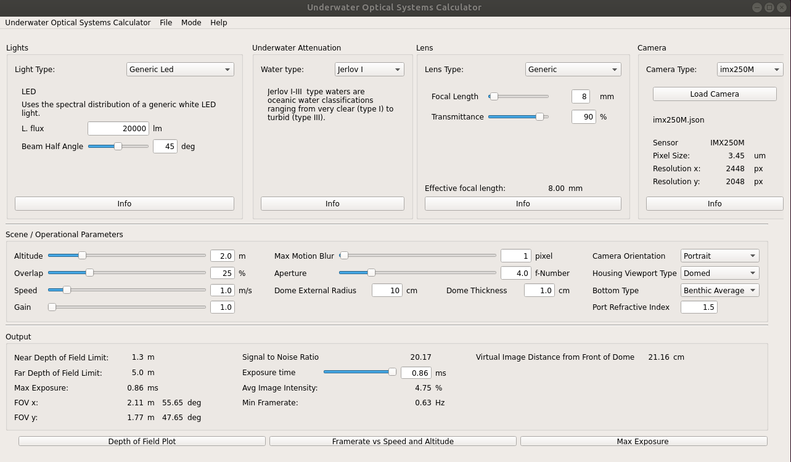

# Parametric Design of Underwater Optical Systems
This tool acts as a simple "back of the envelope" calculator to guide camera and lighting design choices in an underwater camera system. The tool is designed with imaging survey platforms in mind, such as a diver operated rig or an AUV with downward facing camera and strobes. Some features of the tool are not yet fully implemented or are planned for the future, but the tool is functional for the intended design application in this current release.

The tool incorporates modeling of the source lighting spectrum, physical modeling of spectrum dependent light propagation through different water bodies, lensing effects, and manufacturer specified camera sensor response functions to provide realistic estimates of imaging performance, based on a set of input operational parameters.

Global OCEANS 2020 video presentation:
https://youtu.be/aolHdhE3spA

## Python Dependencies: 
Pyqt5
SIP

## Citation  

See our associated [**publication**](https://arxiv.org/abs/2004.06763) for detailed information about the light propogation model and implementation. If you use this tool for research, we request that you cite the following work

```
@article{{billings2020parametric,
    title={Parametric Design of Underwater Optical Systems},
    author={Gideon Billings and Eduardo Iscar and Matthew Johnson-Roberson},
    year={2020},
    journal={IEEE Global OCEANS: Singapore-U.S. Gulf Coast}
}
```

## Tool Use

From src folder, launch GUI as  
`python main.py`

Example image of the user interface  


The interface is divided into three sections: where the top section is hardware and lighting configuration, the middle section is input operational parameters, and the bottom section is the output performance and constraints of the imaging system. Following are brief descriptions of the different parameters.  

#### Lights

Currently the software only supports a generic LED spectrum as the light source, though other sources are included as menu options for future implementation.

#### Underwater Attenuation

This option defines the type of water in which the imaging system is expected to operate, based on the Jerlov classification scale. The poorest expected water type should be selected here for system design considerations. More information about the Jerlov classification scheme can be found here  
http://www.oceanopticsbook.info/view/overview_of_optical_oceanography/classification_schemes

#### Lens

Though a custom lens configuration file may be provided, the generic lens profile is generally good enough for most optics used in the field. Lens transmittance efficency is generally 80-90%.

#### Camera

A dropdown menu of common machine vision sensors are provided. The tool makes it easy to compare different imaging sensors. The selection menu is auto-populated by the configuration files found in the cfg/sensors folder. New sensor configuration files may be added to this folder and will appear in the menu. Also, configuration files can be loaded from custom locations in the interface. Our convention is that sensor names ending in M are monochrome and those that end in C are color sensors.

#### Altitude

Target height-from-bottom at which imaging system will operate, or the expected working distance to the imaging subject.

#### Overlap

In the context of an imaging survey of the seabed, this is the desired percentage overlap between consecutive images.

#### Speed

Speed of imaging system motion along survey path.

#### Gain

Add an analog gain to the sensor response.

#### Max Motion Blur

Maximum allowable pixel blur in the aquired images. For feature matching applications, this is generally desired to be 1 pixel.

#### Aperture

Camera aperture should be set based on the desired depth of field limits displayed in the output section.

#### Camera Orientation

The orientation of the camera referenced to the primary axis of motion. Portrait orientation sets the image width along the axis of motion.

#### Housing Viewport Type

Viewport can be set to flat or dome. When the dome port is selected, extra parameters can also be set, including the dome external radius and the thickness of the port material.

#### Port Index of Refraction

Set the index of refraction according to the port material.

#### Bottom Type

The type of bottom expected to be imaged is an important consideration. Sand bottom reflects the most light, while organic bottoms reflect the least and require more light or exposure time to image. The bottom type is represented by a single value benthic reflection coefficient coarsly estimated from here  
http://www.ioccg.org/training/SLS-2016/Dierssen_IOCCG_Lecture1_webLO.pdf

Spectrum dependence is not considered in the reflection coefficient, as this varies greatly across specific imaging subjects. Support is planned to be added in the future for custom spectrum dependent reflectance profiles.

#### Near and Far Depth of Field Limits

The depth of field limits represent the imaging range at which the subject remains in acceptable focus. These values should be tuned by the aperture setting based on operational requirements. It is desirable to keep the aperture value as low as possible to reduce lighting requirements, so this paramter should be tuned carefully.

#### Max Exposure and Exposure Time

The maximum exposure time is calculated based on the maximum pixel blur and the speed of motion. The actual exposure time of the system can be set to the max exposure time or lower.

#### FOV x and FOV y

The angular field of view in the x and y imaging axes are reported as well as the spacial field of view based on the imaging altitude.

#### Signal to Noise Ratio

The amplitude ratio signal to noise ratio is a primary output for choosing hardware and lighting requirements. This value is calculated based on all optical, operational, and envrionmental parameters. Recent [**studies**](https://iopscience.iop.org/article/10.1088/1742-6596/806/1/012006/meta) on underwater image noise indicate a good target minimum signal to noise ratio is 30dB or an amplitude ratio of 32. An SNR value less than this is considered poor image quality, and feature based image processing methods may suffer in performance.

#### Avg Image Intensity

The average image intensity is another primary output that should be dictate design choices. As a rule of thumb, a good target average image intensity for underwater is ~30%. The gain parameter can be increased to achieve the desired average image intensity, given a satisfactory signal to noise ratio.

#### Min Framerate

The minimum framerate is calcualted based on the speed of the imaging system and the desired minimum overlap between consecutive image frames.

#### Virtual Image Distance from Front of Dome

When a dome port is compressed to a virtual imaging space that extends less than 3 dome radii fron the external dome vertex. The virtual image distance is the actual distance of the focal plane in front of the dome, and is the distance at which the camera should be focused in air to attain the target focal plane underwater.

## Generate UI

To modify and generate the UI use Qt Creator. 
Changes to the UI file have to be converted to python with: 
```pyuic5 qt/UWOpticalSystemDesigner/mainwindow.ui -o src/mainwindow.py```
